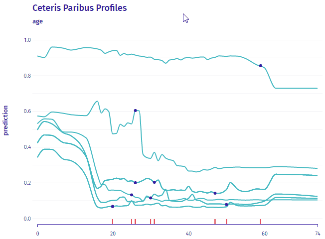

# Model Ingredients 

[](https://github.com/ModelOriented/ingredients/actions?query=workflow%3AR-CMD-check)
[](https://codecov.io/github/ModelOriented/ingredients?branch=master)
[](https://cran.r-project.org/package=ingredients)
[](http://cranlogs.r-pkg.org/badges/grand-total/ingredients)

## Overview

The `ingredients` package is a collection of tools for assessment of feature importance and feature effects. It is imported and used to compute model explanations in multiple packages e.g. [`DALEX`](https://github.com/ModelOriented/DALEX), [`modelStudio`](https://github.com/ModelOriented/modelStudio), [`arenar`](https://github.com/ModelOriented/ArenaR).

Key functions: 

* `feature_importance()` for assessment of global level feature importance, 
* `ceteris_paribus()` for calculation of the Ceteris Paribus / What-If Profiles (read more at https://pbiecek.github.io/ema/ceterisParibus.html),
* `partial_dependence()` for Partial Dependence Plots,
* `conditional_dependence()` for Conditional Dependence Plots also called M Plots,
* `accumulated_dependence()` for Accumulated Local Effects Plots,
* `aggregate_profiles()` and `cluster_profiles()` for aggregation of Ceteris Paribus Profiles,
* `calculate_oscillations()` for calculation of the Ceteris Paribus Oscillations (read more at https://pbiecek.github.io/ema/ceterisParibusOscillations.html),
* `ceteris_paribus_2d()` for Ceteris Paribus 2D Profiles  (read more at https://pbiecek.github.io/ema/ceterisParibus2d.html),
* generic `print()` and `plot()` for better usability of selected explainers,
* generic `plotD3()` for interactive, D3 based explanations,
* generic `describe()` for explanations in natural language.
 
The philosophy behind `ingredients` explanations is described in the [Explanatory Model Analysis: Explore, Explain and Examine Predictive Models](https://pbiecek.github.io/ema/) e-book. The `ingredients` package is a part of [DrWhy.AI](http://DrWhy.AI) universe. 


## Installation

```r
# the easiest way to get ingredients is to install it from CRAN:
install.packages("ingredients")

# Or the the development version from GitHub:
# install.packages("devtools")
devtools::install_github("ModelOriented/ingredients")
```

## Interactive plots with D3

`feature_importance()`, `ceteris_paribus()` and `aggregated_profiles()` also work with **D3**! 
[see an example](https://modeloriented.github.io/ingredients/ceterisParibusDemo.html) 



## Acknowledgments

Work on this package was financially supported by the 'NCN Opus grant 2016/21/B/ST6/02176'.
    
